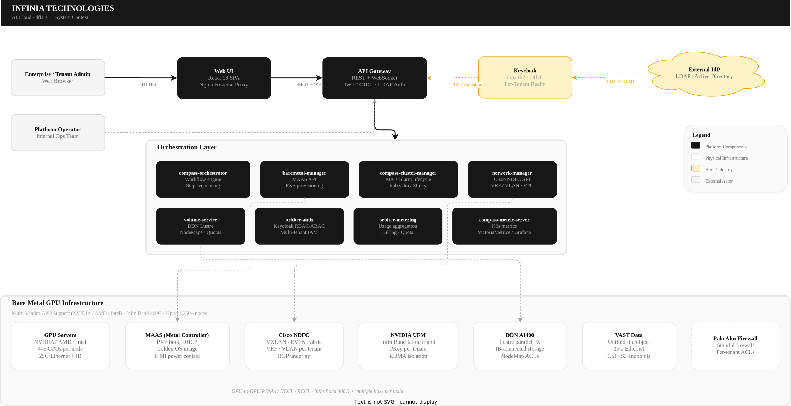
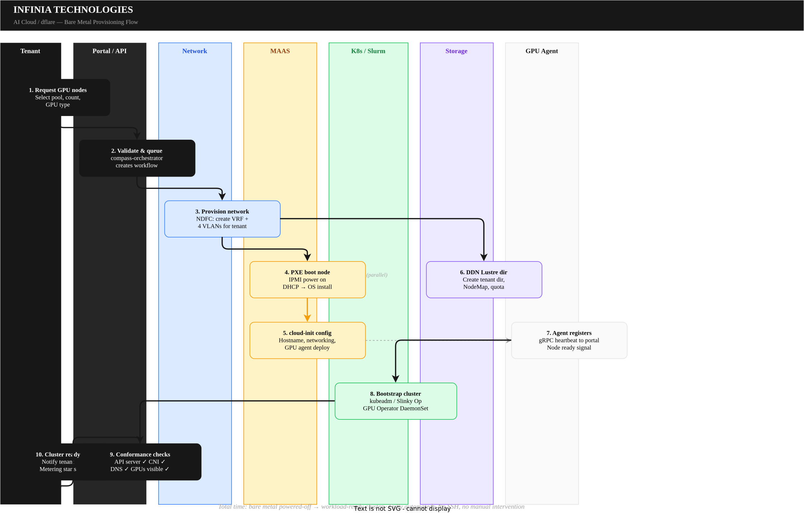
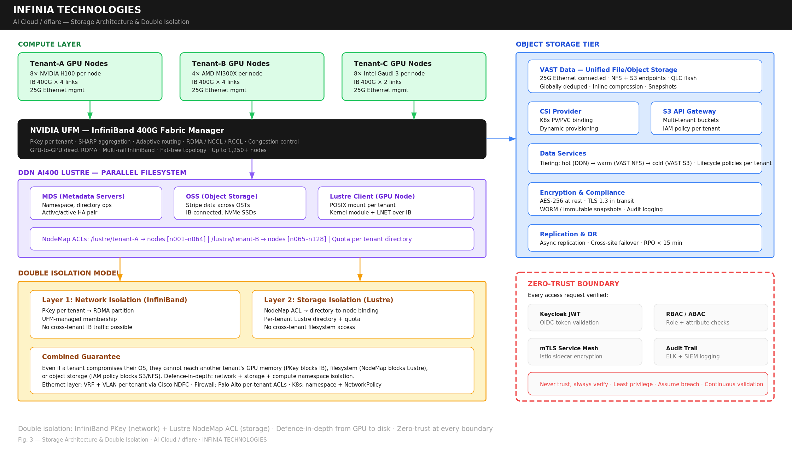
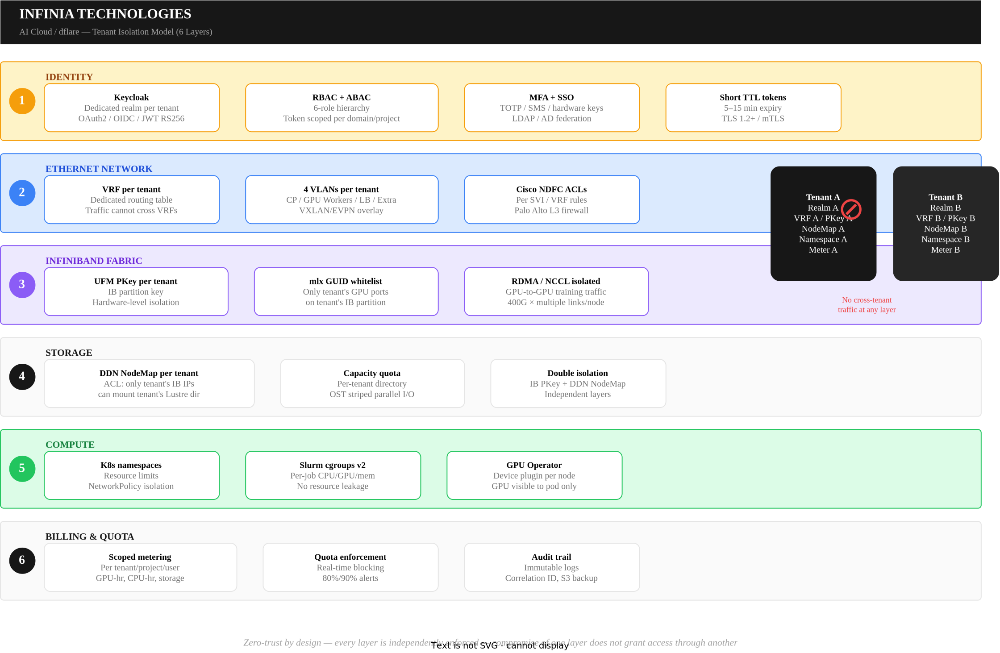
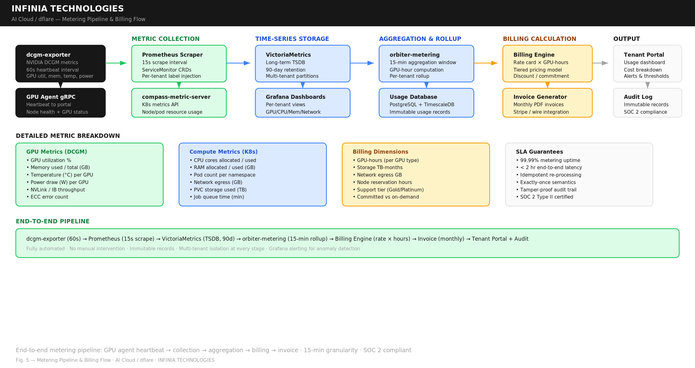
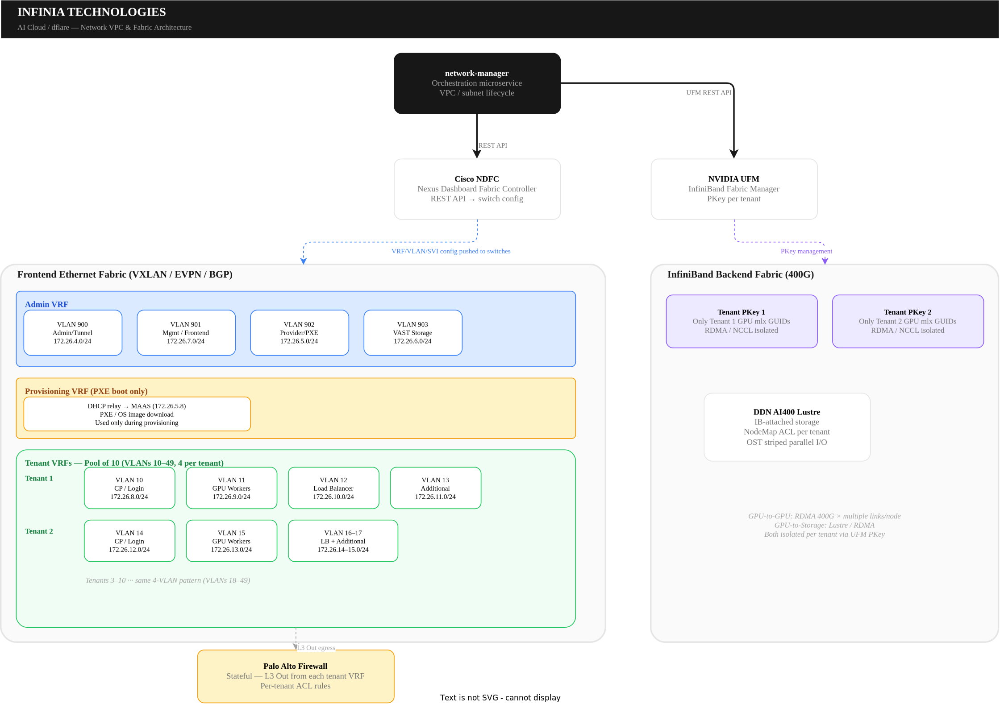
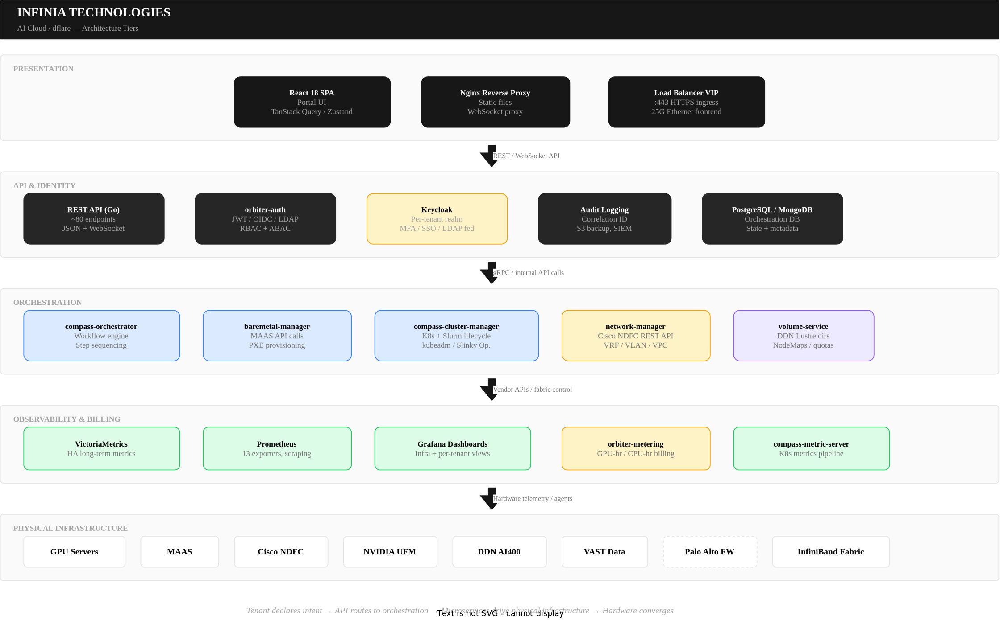
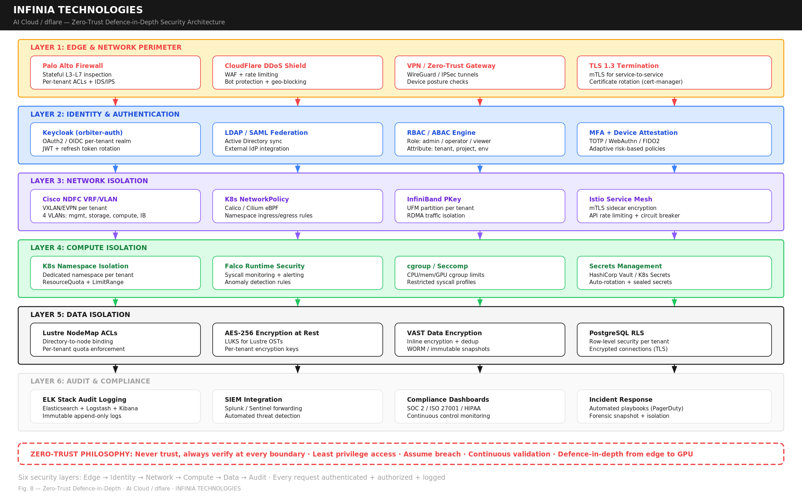
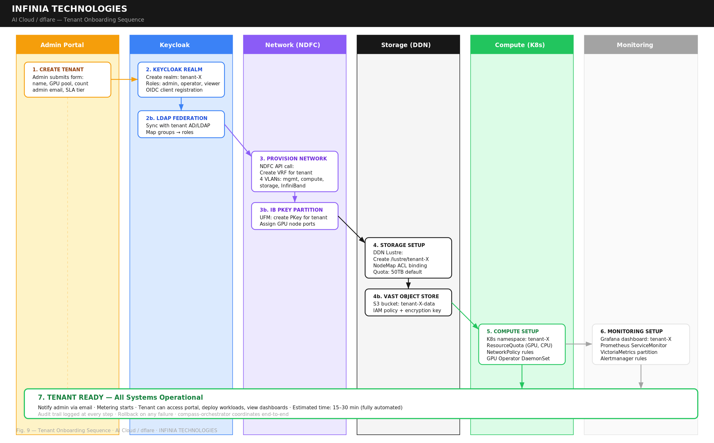

# AI Cloud/dflare

**Enterprise GPU Infrastructure Platform**

---

## Master Technical & Product Reference Document

*Combining Product Marketing Overview & Network VPC/Subnet Orchestration*

| | |
|---|---|
| **Version** | 1.0 |
| **Date** | February 2026 |
| **Classification** | Confidential — For Authorized Distribution Only |
| **Prepared By** | Infinia Technologies |

---

## Table of Contents

- [Section 1 — Executive Summary](#section-1--executive-summary)
- [Section 2 — Market Context & Problem Statement](#section-2--market-context--problem-statement)
- [Section 3 — Product Overview](#section-3--product-overview)
- [Section 4 — Key Features & Capabilities](#section-4--key-features--capabilities)
- [Section 5 — Network VPC & Subnet Orchestration](#section-5--network-vpc--subnet-orchestration)
- [Section 6 — Architecture & Technology Stack](#section-6--architecture--technology-stack)
- [Section 7 — Infrastructure Specifications](#section-7--infrastructure-specifications)
- [Section 8 — Security, Compliance & Governance](#section-8--security-compliance--governance)
- [Section 9 — Use Cases & Target Industries](#section-9--use-cases--target-industries)
- [Section 10 — Competitive Differentiators](#section-10--competitive-differentiators)
- [Section 11 — Deployment Model & Scalability](#section-11--deployment-model--scalability)
- [Section 12 — Support & SLA](#section-12--support--sla)
- [Section 13 — Conclusion](#section-13--conclusion)
- [Appendix: Glossary](#appendix-glossary)

---

## Section 1 — Executive Summary

AI Cloud/dflare is a fully managed, enterprise-grade GPU-as-a-Service (GPUaaS) platform purpose-built for organizations running large-scale artificial intelligence, machine learning, and high-performance computing workloads. The platform transforms bare metal GPU servers into production-ready, multi-tenant compute environments — delivering the raw power of dedicated hardware with the operational simplicity of a managed cloud service.

From a single unified portal, enterprises can provision bare metal GPU nodes, orchestrate Kubernetes and Slurm (HPC) clusters, access high-performance InfiniBand-connected storage, enforce granular multi-tenant security, and track resource consumption with transparent usage-based billing — all without managing the underlying infrastructure complexity.

Built to support multi-vendor GPU architectures — including NVIDIA, AMD, and Intel accelerators — and interconnected via high-speed InfiniBand fabric backed by DDN AI400 parallel storage, AI Cloud/dflare delivers the performance density required for frontier AI training, large language model fine-tuning, scientific simulation, and enterprise inference workloads — at scale, with isolation, and with full operational visibility.

**Who It's For:** Cloud service providers, sovereign AI programs, AI research institutions, enterprise AI teams, and any organization that needs dedicated GPU infrastructure without the operational burden of building and managing it from scratch.

---

## Section 2 — Market Context & Problem Statement

### The AI Infrastructure Challenge

The explosive growth of AI — particularly large language models, generative AI, and deep learning — has created unprecedented demand for GPU compute. Training a single frontier model can require thousands of GPUs running continuously for weeks. Inference at scale demands low-latency, high-throughput GPU clusters. Research teams need flexible, on-demand access to high-performance computing resources.

Yet building and operating GPU infrastructure at this scale is extraordinarily complex:

- **Hardware Complexity:** Modern GPU servers are not commodity hardware. Each node can contain multiple high-end GPUs interconnected via high-bandwidth links, multiple InfiniBand connections at 400Gbps each, specialized cooling, and power requirements exceeding 10kW per node.
- **Multi-Tenancy is Hard:** Serving multiple teams or customers from shared GPU infrastructure demands rigorous isolation — at the network level, the storage level, the identity level, and the compute level.
- **Two Worlds — Containers & HPC:** AI workloads span two operational paradigms. Data engineers prefer Kubernetes; research scientists prefer Slurm. Most platforms force a choice. Supporting both on the same infrastructure is a significant engineering challenge.
- **Storage Performance:** AI training workloads are data-hungry. A single training run can read terabytes of data. The storage system must deliver hundreds of gigabytes per second of aggregate throughput — far beyond what standard NAS or SAN can provide.
- **Operational Overhead:** Even after the infrastructure is built, the ongoing operational burden is substantial — monitoring GPU health, managing firmware, enforcing quotas, tracking resource consumption for billing, maintaining security compliance, and handling tenant lifecycle management.

### What AI Cloud/dflare Solves

AI Cloud/dflare eliminates these challenges by delivering a fully integrated, automated platform that handles the entire lifecycle — from bare metal provisioning to workload execution — through a single pane of glass. Organizations get the performance of dedicated GPU hardware with the operational model of a managed service.

---

## Section 3 — Product Overview

### What AI Cloud/dflare Does

AI Cloud/dflare is an end-to-end GPU infrastructure platform that automates seven critical operational pillars:

| Pillar | What It Does | Why It Matters |
|---|---|---|
| **Bare Metal Provisioning** | Takes physical GPU servers from powered-off to workload-ready — automatically | Minutes to production, not weeks of manual setup |
| **Network Orchestration** | Creates isolated tenant networks with VRFs, VLANs, and InfiniBand partitions | Every tenant gets their own secure, high-performance network |
| **Kubernetes Orchestration** | Builds production-grade K8s clusters with GPU operators, CNI, and monitoring | Container-native AI/ML workflows out of the box |
| **Slurm (HPC) Orchestration** | Deploys Slurm on Kubernetes via Slinky Operator for batch job scheduling | HPC users get familiar tools (sbatch, squeue) on modern infrastructure |
| **Storage Orchestration** | Provisions high-performance DDN Lustre storage over InfiniBand + VAST platform storage | GPU nodes access training data at maximum fabric throughput |
| **Security & Access Control** | Enforces RBAC + ABAC with Keycloak, per-tenant isolation at every layer | Zero-trust by design — no action is trusted by default |
| **Billing & Metering** | Tracks GPU-hours, CPU-hours, storage, network — converts to billable records | Transparent, accurate, usage-based billing |

### How It Works — At a Glance

A tenant administrator logs into the portal, creates a project, selects GPU nodes from available pools, and requests a cluster. The platform automatically provisions networking, installs the operating system, configures storage, bootstraps the cluster (Kubernetes or Slurm), deploys GPU runtime operators, enables monitoring, and begins metering — all without manual intervention.

### Platform Architecture Overview

> **Figure 1 — System Context Diagram**

*System Context Diagram*

---

## Section 4 — Key Features & Capabilities

### 4.1 Automated Bare Metal Provisioning

**Business Value:** Reduce GPU server provisioning from days of manual work to minutes of automated orchestration. No SSH, no manual OS installs, no network cable tracing.

> **Figure 2 — Bare Metal Provisioning Flow**

*Bare Metal Provisioning Flow*

**How It Works:**

The provisioning engine coordinates seven components in a fully automated pipeline. When a tenant requests GPU nodes through the portal, the platform executes the following sequence without human intervention:

- The network fabric (Cisco NDFC) prepares isolated VRFs and VLANs for the tenant
- The metal controller (MAAS) powers on the physical server via IPMI, boots it over PXE, and installs a performance-optimized golden OS image
- Cloud-init configures the node's hostname, networking, and deploys the GPU agent
- The storage layer creates a dedicated DDN Lustre directory with InfiniBand access control
- The GPU agent registers with the portal, and the node is ready for cluster assignment

**Technical Highlights:**

- PXE-based network boot with DHCP relay across provisioning VLANs
- Golden OS image with pre-tuned BIOS settings: performance profile, C-states disabled, NUMA alignment enabled, PCIe ASPM disabled, virtualization disabled
- OS-level tuning: CPU governor locked to performance, huge pages enabled, NUMA balancing disabled
- Agent-based architecture: lightweight gRPC agent (ports 8030/8040) on every node for secure, bidirectional communication with the portal
- Full deallocation flow: workload drain → network removal → storage cleanup → node returned to pool

**Supported Hardware:** Enterprise GPU server platforms from multiple vendors, with configurable server profiles, GPU types, and accelerator configurations. Scalable to 1,250+ nodes per deployment.

### 4.2 Kubernetes Cluster Orchestration

**Business Value:** Go from bare metal to a fully functional, GPU-enabled Kubernetes cluster — with networking, monitoring, and GPU operators pre-configured — through a simple portal form.

**How It Works:**

Users select their desired configuration: Kubernetes version, CNI plugin (Calico or Cilium), node pools (control plane + GPU workers), host flavors, labels, and taints. The platform handles everything else:

- Installs container runtime (containerd), Kubernetes binaries (kubelet, kubeadm, kubectl), and bootstraps the control plane with etcd in HA quorum (3 or 5 nodes)
- Deploys the chosen CNI plugin for pod networking — Calico (BGP-based with IP-in-IP overlay) or Cilium (eBPF-powered, kernel-level packet processing)
- Joins GPU worker nodes, applies labels and taints, and deploys GPU runtime operators: GPU drivers, device plugin, telemetry exporter, and GPU feature discovery
- Runs conformance checks: API server reachable, all nodes Ready, CNI healthy, DNS resolving, GPUs visible

**Technical Highlights:**

- All container images pulled from the platform's internal registry — enabling air-gapped, version-controlled deployments
- Static pods for control plane components (apiserver, etcd, controller-manager, scheduler) — self-bootstrapping without external dependencies
- GPU runtime operators deploy as DaemonSets: device plugin registers GPU resources per node, telemetry exporter provides per-GPU metrics, feature discovery labels nodes with GPU properties
- Full lifecycle operations: upscale, downscale (cordon → drain → remove), rolling upgrades (zero-downtime), and clean deletion with host return to pool
- Multi-vendor GPU support: compatible with NVIDIA GPU Operator, AMD GPU Operator (ROCm), and extensible to Intel GPU plugins

### 4.3 Slurm (HPC) Cluster Orchestration

**Business Value:** Give HPC and research teams the Slurm experience they know — sbatch, squeue, srun — running on modern, Kubernetes-managed infrastructure with enterprise security and billing.

**How It Works:**

AI Cloud/dflare runs Slurm on top of Kubernetes using the Slinky Operator. The platform first builds a complete Kubernetes cluster, then layers Slurm on top as Kubernetes-native objects:

- The Slinky Operator deploys all Slurm daemons: slurmctld (controller), slurmd (compute daemon on every GPU node), slurmdbd (accounting database), slurmrestd (REST API), and MUNGE (authentication)
- Configuration files — slurm.conf, gres.conf, cgroup.conf — are auto-generated from the cluster spec and distributed as Kubernetes ConfigMaps
- MariaDB runs as a StatefulSet with persistent storage for job accounting
- GPU-aware scheduling via GRES plugin: Slurm understands GPU topology, NUMA affinity, and inter-GPU connectivity for optimal multi-GPU job placement across supported GPU vendors

**Technical Highlights:**

- Unified infrastructure: same bare metal nodes, same networking, same storage, same monitoring — whether running K8s or Slurm workloads
- GPU-aware scheduling: `--gres=gpu:<type>:<count>` tells the scheduler exactly which nodes have the right GPU type and count available
- Job isolation via Linux cgroups v2: each job is confined to its allocated CPUs, memory, and GPUs — no resource leakage between jobs
- Fair-share scheduling: tenants who have used less than their allocation get higher job priority
- Full job accounting: every completed job generates a detailed record — GPU-hours, CPU-hours, elapsed time, memory consumed, exit code — feeding directly into the billing pipeline
- Job submission via portal UI, sbatch CLI, or slurmrestd REST API

### 4.4 High-Performance Storage

**Business Value:** GPU workloads are only as fast as their data pipeline. AI Cloud/dflare delivers storage throughput that keeps up with the most demanding training jobs — leveraging the full bandwidth of the InfiniBand fabric.

**Two Storage Systems, Optimized for Purpose:**

| System | Technology | Connection | Purpose |
|---|---|---|---|
| **DDN AI400** | Lustre parallel filesystem | InfiniBand (400G x multiple links per node) | Training datasets, model checkpoints, experiment results |
| **VAST Data** | Unified file/object storage | Ethernet (25G) | Platform services (databases, backups, logs, container registry) |

> **Figure 3 — Storage Architecture & Double Isolation**

*Storage Architecture & Double Isolation*

#### DDN Lustre — The Fast Storage

When a tenant is onboarded, the platform automatically provisions dedicated storage with multi-layer access control:

- Creates a tenant directory on the Lustre parallel filesystem
- Creates a DDN NodeMap — an access control list of InfiniBand IP addresses allowed to mount the directory
- Assigns only the tenant's GPU node IB IPs to the NodeMap
- Sets capacity quotas based on the tenant's subscription
- Data is striped across multiple Object Storage Targets (OSTs) for parallel I/O — delivering massive aggregate throughput

#### Storage Security — Double Isolation

Tenant storage isolation is enforced at two independent layers simultaneously:

- **1. InfiniBand level (UFM PKey):** Only the tenant's GPU ports can communicate on the tenant's IB partition
- **2. DDN Lustre level (NodeMap):** Only the tenant's IB IP addresses can mount the tenant's directory

Even if one layer were compromised, the other would still block unauthorized access.

### 4.5 Multi-Tenant Security & Access Control

**Business Value:** Serve multiple tenants — internal teams or external customers — from shared infrastructure with confidence that each tenant's data, workloads, and resources are completely isolated.

> **Figure 4 — Tenant Isolation Model (6 Layers)**

*Tenant Isolation Model (6 Layers)*

*Zero-trust by design — every layer is independently enforced — compromise of one layer does not grant access through another.*

#### Six-Role Hierarchy

| Role | Scope | Capabilities |
|---|---|---|
| **Platform Super Admin** | Global | Full control over all tenants, infrastructure, and platform configuration |
| **Domain Admin** | Tenant | Full control within their tenant: users, projects, clusters, quotas, networking |
| **Organization Admin** | Organization | Manage projects and users within their organization |
| **Project Admin** | Project | Create/manage clusters, provision bare metal, deploy workloads |
| **Member** | Project | Deploy workloads, submit jobs, view monitoring — operational access |
| **Viewer** | Project | Read-only access to cluster status, dashboards, and resource usage |

#### Tenant Isolation — Enforced at Every Layer

| Layer | Mechanism | What It Isolates |
|---|---|---|
| **Identity** | Dedicated Keycloak realm per tenant | Users, roles, sessions, authentication flows |
| **Network (Ethernet)** | VRF + VLAN per tenant (Cisco NDFC) | All Ethernet traffic between tenants |
| **Network (InfiniBand)** | UFM PKey per tenant | GPU-to-GPU and GPU-to-storage traffic at IB switch hardware level |
| **Storage** | DDN NodeMap per tenant | Lustre directory access restricted to tenant's IB IPs |
| **Compute** | K8s namespaces + Slurm accounts | Workload and resource isolation |
| **Billing** | Scoped metering per tenant/project/user | Usage data and billing records |

#### Authentication & Token Security

- OAuth2/OpenID Connect with JWT tokens signed using RS256
- Short token TTL (5–15 minutes) to minimize exposure window
- TLS 1.2+ on all communications, mTLS between internal services
- MFA support: TOTP, SMS, email, hardware keys
- LDAP/Active Directory federation for enterprise SSO
- Session management with admin force-logout capability

### 4.6 Usage Metering & Billing

**Business Value:** Know exactly what each tenant, project, and user consumes — down to GPU-hours, storage bytes, and network bandwidth — with transparent, auditable billing records.

#### What Gets Metered

| Resource | What's Measured | How | Granularity |
|---|---|---|---|
| **GPU Compute** | GPU-hours, utilization %, memory, power draw, temperature | GPU telemetry exporter on every node | Per GPU, 15-sec intervals |
| **CPU Compute** | CPU-hours, utilization %, core count, memory | Node Exporter on every node | Per node, 15-sec intervals |
| **Bare Metal Allocation** | Node-hours: allocation start → release | Orchestration DB timestamps | Per node, precise timestamps |
| **K8s Cluster Runtime** | Cluster-hours: creation → deletion | Orchestration DB lifecycle events | Per cluster |
| **Slurm Jobs** | Per-job GPU-hours, CPU-hours, elapsed time, memory, exit code | slurmdbd accounting daemon → MariaDB | Per job |
| **Storage (DDN)** | Directory size, quota utilization, I/O throughput | DDN reporting + Storage Plugin | Per tenant directory |
| **Storage (VAST)** | PVC usage, S3 bucket size, object count | VAST management + CSI metrics | Per PVC, per bucket |
| **Network (InfiniBand)** | Bandwidth per tenant, RDMA throughput, packet drops | UFM telemetry + IB port counters | Per PKey (per tenant) |

#### Metering Pipeline

> **Figure 5 — Metering Pipeline Flow**

*Metering Pipeline Flow*

Raw metrics flow through a multi-stage pipeline: hardware-level exporters collect data every 15–30 seconds → Prometheus scrapes and stores short-term → VictoriaMetrics provides long-term HA storage → orbiter-metering aggregates into billable records per tenant/project/user → billing reports generated and exportable as CSV/PDF.

#### Quota Management

Pre-set resource limits prevent overspend and ensure fair capacity distribution. Quotas are enforced in real-time — if a tenant exceeds their quota, new resource creation is blocked. The portal dashboard shows quota usage with color-coded warnings at 80% and 90% thresholds.

### 4.7 Enterprise Monitoring & Observability

**Business Value:** Full visibility into GPU health, cluster performance, job queues, and resource utilization — for both platform operators and tenants — with proactive alerting.

#### Tier 1 — Infrastructure Monitoring (Platform Ops, Always On)

Deployed alongside the orchestration portal for operations teams. Powered by VictoriaMetrics (HA) + External Grafana with 13 exporters covering every infrastructure layer.

#### Tier 2 — Tenant Monitoring (User-Enabled Add-On)

Deployed inside each tenant's cluster when the user enables the monitoring add-on. Includes Prometheus, Node Exporter, Pod Exporter, K8s State Exporter, and GPU Telemetry Exporter. Dashboards rendered inside the portal with strict multi-tenant isolation.

#### Alert Thresholds

| Metric | Threshold | Action |
|---|---|---|
| **GPU Temperature** | > 80°C for 10 minutes | Alert ops team |
| **CPU Utilization** | > 75% cluster-wide | Capacity warning |
| **Memory Utilization** | > 70% node-level | Capacity warning |
| **Storage Latency** | > 15ms | Performance investigation |
| **Slurm Job Queue** | > 100 pending jobs | Scheduling review |
| **GPU Resource Allocation** | > 90% cluster-wide | Capacity planning |
| **etcd Leader Changes** | > 3/hour | Stability investigation |

---

## Section 5 — Network VPC & Subnet Orchestration

In the GPUaaS platform, a VPC (Virtual Private Cloud) is a tenant-isolated virtual network built on top of physical switches using VRF (Virtual Routing and Forwarding) technology. Each VPC provides a completely isolated routing domain — traffic from one tenant's VPC cannot reach another tenant's VPC unless explicitly allowed.

A Subnet is a segment within a VPC. Each subnet has a VLAN ID, a CIDR block (IP range), a gateway, and ACL rules. Subnets are where GPU nodes, control planes, load balancers, and worker nodes actually connect.

The platform automates VPC and subnet lifecycle through the network-manager microservice, which talks to Cisco NDFC (Nexus Dashboard Fabric Controller) to program the physical switches.

### Network Architecture: How It's Built

> **Figure 6 — Network VPC & Fabric Architecture**

*Network VPC & Fabric Architecture*

*GPU-to-GPU: RDMA 400G × multiple links/node · GPU-to-Storage: Lustre/RDMA · Both isolated per tenant via UFM PKey*

#### Frontend Fabric (Ethernet)

The FE (Frontend) fabric is a Cisco-managed Ethernet fabric that carries all management, control plane, and tenant Ethernet traffic. It uses VXLAN/EVPN for overlay networking with BGP underlay. The fabric is managed by Cisco NDFC, which provides a centralized API for programmatic VRF/VLAN/subnet provisioning.

#### VRF Types (The Foundation of VPCs)

The FE fabric has five categories of VRFs, each serving a distinct purpose:

| VRF Type | Purpose | Who Uses It | How VPCs Relate |
|---|---|---|---|
| **Admin VRF** | Hosts all management traffic for the orchestration portal. | Platform ops, portal, MAAS controller | Not tenant-visible. Internal management network. |
| **Provisioning VRF** | Dedicated to initial bootstrapping of GPU nodes via PXE. | MAAS, GPU nodes during PXE boot | Not tenant-visible. Used only during BM provisioning. |
| **Tenant VRFs (Pool of 10)** | Dedicated per-tenant. Carries GPU worker registration, cluster CP, workload data plane, DDN storage. Each tenant gets 4 VLANs. | Tenants, GPU workers, K8s/Slurm clusters | This IS the tenant's VPC. Portal VPC maps to one of these. |
| **Outside Infra VRF** | Connects to external infrastructure for DNS, NTP, Syslog, LDAP/AD. | All nodes (shared services) | Not tenant-visible. Shared service connectivity. |
| **VRF Default (Infra)** | Underlay VRF for the FE fabric. Basic IP reachability between switches. | Fabric switches only | Not tenant-visible. Physical transport layer. |

#### Backend Fabric (InfiniBand)

Separate from the Ethernet FE fabric, an InfiniBand backend fabric managed by NVIDIA UFM handles GPU-to-GPU communication. Tenant isolation on IB is achieved via UFM PKeys (partition keys) — each tenant gets a unique PKey, and only their GPU nodes' mlx GUIDs are added to that partition. This ensures GPU-to-GPU RDMA/NCCL traffic is completely isolated between tenants.

### Frontend: What the User Sees & Does

From the portal, users interact with VPCs and subnets as logical networking constructs. They don't see VRFs, VLANs, NDFC, or switches.

| Action | What the User Does in Portal | What It Maps To (Backend) |
|---|---|---|
| **Create VPC** | Names the VPC, selects project/org assignment | Allocates a pre-created tenant VRF from the pool. |
| **Add Subnet** | Specifies subnet name, CIDR, gateway. Selects purpose. | Allocates a pre-created VLAN within the tenant VRF. |
| **Assign VPC to Cluster** | Selects VPC/subnet for CP, workers, LB. | VLANs configured on GPU nodes' switch ports. |
| **Delete VPC** | Removes entire VPC (all subnets must be empty). | Deallocates tenant VRF. Returns to pool. |

### Backend: What Happens on the Network Fabric

#### Flow 1 — Create New Network (Dynamic Provisioning)

| # | Action | Description |
|---|---|---|
| 1 | **User Request** | Tenant requests new VPC/subnet via portal UI or API. |
| 2 | **Portal → network-manager** | Portal sends request with tenant ID, project ID, CIDR, gateway, VPC name. |
| 3 | **network-manager → NDFC** | Calls Cisco NDFC REST API to create VRF + VLAN/VXLAN segment + subnet/gateway + ACL rules. |
| 4 | **NDFC → Switches** | NDFC pushes config to physical leaf and spine switches. VRF, VLAN, SVI, ACLs programmed. |
| 5 | **Response** | NDFC returns VLAN ID, VXLAN VNI, subnet CIDR, gateway IP, VRF name. |
| 6 | **Store in DB** | Portal stores VPC/subnet metadata in orchestration DB and associates with tenant/project. |
| 7 | **Firewall (Manual)** | Network admin configures firewall rules on Palo Alto for the new network. |

#### Flow 2 — Allocate Pre-Created Network

In production, tenant networks are often pre-created by the fabric admin to ensure consistency and compliance:

| # | Action | Description |
|---|---|---|
| 1 | **Admin Pre-Creates** | Fabric admin creates network segment in NDFC: VLAN/VXLAN ID, subnet, gateway, ACLs, routing policies. |
| 2 | **User Requests** | Tenant requests VPC allocation via portal. Selects pre-created network by reference ID. |
| 3 | **Ownership Update** | Portal calls network-manager with Allocate VPC action + tenant/org/project ID. |
| 4 | **Metadata Link** | network-manager updates ownership in DB. No NDFC API call needed — network already exists. |
| 5 | **Ready** | Tenant can now deploy clusters and workloads on the assigned network. |

### VLAN Architecture: Actual IPs & Segments

#### Admin VRF VLANs (Platform Infrastructure)

| VLAN | Name | CIDR | Gateway | Purpose |
|---|---|---|---|---|
| 900 | Admin/Tunnel | 172.26.4.0/24 | 172.26.4.1 | Admin tunnel traffic between orchestration components |
| 901 | Mgmt/Frontend (C1) | 172.26.7.0/24 | 172.26.7.1 | Portal → Metal Controller, agents, mgmt API |
| 902 | Provider Tenant | 172.26.5.0/24 | 172.26.5.1 | DHCP relay from GPU nodes to Metal Controller for PXE |
| 903 | Storage | 172.26.6.0/24 | 172.26.6.1 | VAST Data platform storage (S3 endpoints) |

#### Tenant VRF VLANs (Per-Tenant VPC Networks)

Each tenant gets 4 VLANs from a pre-created pool. 10 tenant VRFs are provisioned with 4 VLANs each (40 VLANs total, VLANs 10–49):

| Tenant | VLANs | Subnets | VLAN Purpose (4 per tenant) |
|---|---|---|---|
| Tenant 1 | 10, 11, 12, 13 | 172.26.8.0/24 – 172.26.11.0/24 | CP/Login \| GPU Workers \| Load Balancer \| Additional |
| Tenant 2 | 14, 15, 16, 17 | 172.26.12.0/24 – 172.26.15.0/24 | Same 4-VLAN structure per tenant |
| Tenant 3 | 18, 19, 20, 21 | 172.26.16.0/24 – 172.26.19.0/24 | Same 4-VLAN structure per tenant |
| ... | ... | ... | Pattern continues for Tenants 4–10 |
| Tenant 10 | 46, 47, 48, 49 | 172.26.44.0/24 – 172.26.47.0/24 | Same 4-VLAN structure per tenant |

### What NDFC Configures on Switches

| Config Element | What It Is | What NDFC Creates on Switches |
|---|---|---|
| **VRF Instance** | Isolated routing table | `vrf context TENANT-1-VRF` with unique VNI. All routes isolated. |
| **VLAN** | Layer 2 broadcast domain | `vlan <id>` with name, mapped to VXLAN VNI. |
| **VXLAN Segment** | Overlay tunnel | VXLAN encapsulation spanning multiple leaf switches. |
| **SVI (Gateway)** | L3 interface for subnet | `interface vlan <id>` with IP (gateway), assigned to tenant VRF. |
| **EVPN Config** | Control plane for VXLAN | BGP EVPN with route-target import/export for VRF. |
| **ACLs** | Access control lists | Permit/deny rules on SVI or VRF for policy enforcement. |
| **L3 Out (External)** | External routing | L3 out gateway towards Palo Alto firewall. |
| **Switch Port Config** | Physical port assignment | GPU node port configured with tenant's VLAN (trunk/access). |

### How VPC/Subnet Participates in Platform Workflows

#### During Bare Metal Provisioning

| Step | Network Action | VLANs Used |
|---|---|---|
| PXE Boot | GPU node's NIC broadcasts DHCP Discover on its SU Inband VLAN | VLAN 23/33/43/53/63 (Inband per SU) |
| DHCP Relay | DHCP request relayed to Metal Controller (172.26.5.8) | VLAN 902 (Provider Tenant) |
| OS Install | Golden image downloaded from MAAS over SU Inband VLAN | VLAN 23/33/43/53/63 |
| Agent Connect | Agent connects to portal over management network | VLAN 901 (Mgmt/Frontend) |

#### During Cluster Creation

| Step | Network Action | VLANs Used |
|---|---|---|
| VIP/LB Creation | Control plane VIP created on tenant CP subnet | Tenant VLAN 1 (Control Plane) |
| Worker Join | GPU workers join K8s cluster over tenant network | Tenant VLAN 2 (GPU Workers) |
| CNI Overlay | Calico/Cilium creates pod overlay on top of tenant VLAN | Tenant VLAN 2 (IP-in-IP/eBPF) |
| LB Assignment | External-facing LB IPs allocated from tenant LB subnet | Tenant VLAN 3 (Load Balancer) |
| Agent Instructions | Portal sends bootstrap/deployment via agent gRPC | VLAN 901 (Mgmt) |

#### During Workload Execution

| Traffic Type | Network Path | Protocol |
|---|---|---|
| GPU-to-GPU (training) | InfiniBand backend fabric (UFM PKey isolated) | RDMA / NCCL (400G x10) |
| GPU-to-Storage | InfiniBand → DDN AI400 Lustre | Lustre / RDMA |
| Pod-to-Pod | Tenant VLAN via CNI overlay (Calico/Cilium) | Overlay (IP-in-IP / eBPF) |
| External access | Tenant LB VLAN → Ingress Controller | HTTP/HTTPS |
| Monitoring metrics | VLAN 901 (Mgmt) / internal cluster | HTTP (Prometheus endpoints) |

### Firewall Rules & ACLs

A Palo Alto firewall sits between the orchestration layer and GPU nodes. Three levels of ACLs are enforced:

#### Management Traffic ACLs

- **PXE reachability:** Metal Controller (172.26.5.8) → GPU BMC nodes for OS provisioning and boot device control.
- **IPMI reachability:** Metal Controller → GPU BMC for power on/off, boot device setting.
- **Shared services:** All nodes → Proxy, DNS, NTP, Syslog, SSH via Outside Infra VRF.

#### Tenant Network ACLs

- **CP → Worker:** Control plane to GPU worker node communication over tenant network.
- **IP-in-IP overlay:** GPU-to-GPU overlay communication within IRIS for CNI pod networking.
- **Agent connectivity:** Connectivity agent communication for CP connectivity between managed CP and GPU workers.

### Network Security Model

| Layer | Mechanism | Details |
|---|---|---|
| **Tenant Isolation** | VRF (separate routing table per tenant) | Dedicated VRF per tenant VPC. VXLAN/EVPN ensures overlay isolation. |
| **Subnet Isolation** | VLAN + ACLs | Each subnet is a separate VLAN. ACLs restrict inter-subnet communication. |
| **IB Isolation** | UFM PKey (partition key) | InfiniBand traffic isolated per tenant. Only tenant GPU mlx GUIDs added to PKey. |
| **Firewall** | Palo Alto | Stateful firewall with per-tenant rules. L3 Out from each tenant VRF through firewall. |
| **Authentication** | Keycloak OAuth2/JWT | All network API calls require valid JWT. Tenants manage only their own VPCs. |
| **Transport** | TLS 1.2+, mTLS, HSTS | All API communication encrypted. NDFC API calls use TLS. |
| **Audit** | Centralized logging, S3 backup | All operations logged with correlation ID. SIEM integration in progress. |

---

## Section 6 — Architecture & Technology Stack

> **Figure 7 — Architecture Tiers**

*Architecture Tiers*

*Tenant declares intent → API routes to orchestration → Microservices drive physical infrastructure → Hardware converges*

### Platform Component Map

| Layer | Components | Technology |
|---|---|---|
| **Portal & API** | Orchestration UI, REST APIs, WebSocket status | React, Python, Go, PostgreSQL, MongoDB, Redis |
| **Identity & Access** | Authentication, authorization, tenant mgmt | Keycloak (OAuth2/OIDC), JWT, RBAC + ABAC |
| **Compute Orchestration** | Cluster lifecycle, workload management | Kubernetes (kubeadm), Slurm (Slinky Operator) |
| **Network Fabric** | Tenant isolation, VLAN/VRF management | Cisco NDFC, VXLAN/EVPN, NVIDIA UFM |
| **Storage** | High-performance GPU + platform storage | DDN AI400 (Lustre/IB), VAST Data (CSI/S3) |
| **GPU Runtime** | GPU access, telemetry, scheduling | Multi-vendor Operators (NVIDIA, AMD ROCm, Intel) |
| **Monitoring** | Metrics, alerting, dashboards | VictoriaMetrics, Prometheus, Grafana |
| **Billing** | Usage tracking, quota, reporting | orbiter-metering, PostgreSQL |
| **Container Runtime** | Container lifecycle on bare metal | containerd, runc, OCI-compliant |

### Key Microservices

| Service | Responsibility |
|---|---|
| **baremetal-manager** | Bare metal provisioning — translates portal requests into MAAS API calls |
| **compass-orchestrator** | Workflow engine — handles provisioning logic, scheduling, and step sequencing |
| **compass-cluster-manager** | Kubernetes and Slurm cluster lifecycle management |
| **network-manager** | Interfaces with Cisco NDFC for VRF/VLAN operations |
| **volume-service** | DDN Lustre provisioning — directories, NodeMaps, quotas |
| **orbiter-auth** | Keycloak integration for multi-tenant RBAC/ABAC enforcement |
| **orbiter-metering** | Usage aggregation, billing calculation, quota tracking |
| **compass-metric-server** | Kubernetes metrics processing for tenant clusters |
| **container-registry** | Internal image registry for air-gapped deployments |

---

## Section 7 — Infrastructure Specifications

### Compute

| Specification | Detail |
|---|---|
| **Supported Servers** | Enterprise GPU server platforms (Dell PowerEdge, HPE ProLiant, Supermicro, Lenovo ThinkSystem) |
| **Supported GPUs** | NVIDIA (H100, A100, H200, B200), AMD (MI300X, MI250X), Intel (Gaudi, Max Series) |
| **GPUs per Node** | Configurable — typically 4 to 8 GPUs per node |
| **GPU Interconnect** | Vendor-specific high-bandwidth links (NVLink, Infinity Fabric, etc.) |
| **InfiniBand Links** | Multiple 400Gbps links per node (configurable) |
| **Ethernet** | 25G frontend |
| **Maximum Nodes** | 1,250+ per deployment |
| **Maximum GPUs** | 10,000+ accelerators per deployment |

### Network

| Fabric | Technology | Speed |
|---|---|---|
| **GPU-to-GPU (training)** | InfiniBand via RDMA/NCCL/RCCL | 400G x multiple links per node |
| **GPU-to-Storage (data)** | InfiniBand via Lustre/RDMA | 400G x multiple links per node |
| **Platform Services** | Ethernet (VLAN 903) | 25G |
| **Tenant Isolation** | VRF (VXLAN/EVPN) + UFM PKey | Hardware-enforced |

### Performance Tuning (Applied via Golden OS Image)

| Layer | Setting | Purpose |
|---|---|---|
| **BIOS** | Performance profile, C-states disabled | Maximum clock speeds, zero power-save latency |
| **BIOS** | NUMA alignment enabled | GPU PCIe aligned to nearest CPU socket |
| **BIOS** | PCIe ASPM disabled, virtualization off | Zero overhead for bare metal GPU workloads |
| **OS** | CPU governor: performance | Locked maximum frequency |
| **OS** | Huge pages: always | Optimized GPU memory allocation |
| **OS** | IOMMU enabled with passthrough | Direct device passthrough for accelerators |

---

## Section 8 — Security, Compliance & Governance

### Zero-Trust Security Model

AI Cloud/dflare implements defense-in-depth with zero-trust principles — no action is trusted by default, every request is authenticated and authorized at multiple levels:

> **Figure 8 — Zero-Trust Defense-in-Depth**

*Zero-Trust Defense-in-Depth*

| Security Layer | Mechanism | Protection |
|---|---|---|
| **Authentication** | Keycloak OAuth2/JWT, RS256, short TTL, MFA | Identity verification for every interaction |
| **Authorization** | RBAC + ABAC via orbiter-auth | Role and context validation on every action |
| **Transport** | TLS 1.2+, mTLS between services, HSTS | Encrypted communication, mutual authentication |
| **Network Isolation** | VRF/VLAN (Ethernet), UFM PKey (IB) | Hardware-enforced tenant traffic separation |
| **Storage Isolation** | DDN NodeMap + UFM PKey | Two independent layers protecting tenant data |
| **Compute Isolation** | K8s namespaces, Slurm cgroups v2 | Workload-level resource confinement |
| **Audit** | Correlation ID, immutable logs, S3 backup | Full traceability of every action |
| **Firewall** | Palo Alto with ACLs | Strict access control at network perimeter |

### Compliance Alignment

| Standard | Control Area | Implementation |
|---|---|---|
| **NIST 800-53 Rev 5** | AC — Access Control | RBAC via Keycloak, SSO, scoped tokens, tenant realm isolation |
| **NIST 800-53 Rev 5** | AU — Audit | Immutable logs, session tracking, telemetry pipeline |
| **ISO/IEC 27001** | A.9 Access Control | IAM with RBAC, SSO, scoped roles per domain/project/org |
| **ISO/IEC 27001** | A.10 Cryptography | TLS/mTLS, PKI, Keycloak certificate lifecycle management |
| **HIPAA** | Access Control | IAM, RBAC, ACLs, SSO, scoped tokens per tenant |
| **HIPAA** | Audit Controls | Immutable logs, session playback, telemetry pipeline |

### Data Protection

- All metering and billing data stored in platform-controlled databases with no tenant write access
- PostgreSQL metering data backed up to VAST S3 every 6 hours
- VictoriaMetrics provides HA storage with replication for metrics data
- S3 lifecycle rules: Standard → Infrequent Access → Archive (12–24 months retention)
- Sensitive data anonymized where feasible; compliant with GDPR data minimization principles

---

## Section 9 — Use Cases & Target Industries

### Primary Use Cases

**Large-Scale AI Model Training:** Train frontier AI models across hundreds or thousands of GPUs. InfiniBand-connected nodes enable efficient multi-node distributed training with RDMA collective operations. DDN Lustre delivers the storage throughput to keep GPUs fed with training data.

**LLM Fine-Tuning & RLHF:** Fine-tune large language models on proprietary datasets with dedicated GPU allocation, isolated storage, and job-level accounting. Slurm's fair-share scheduling ensures equitable access across research teams.

**AI Inference at Scale:** Deploy inference services on Kubernetes clusters with GPU resource requests, auto-scaling, and load balancing. Monitor GPU utilization and latency through integrated dashboards.

**High-Performance Computing (HPC):** Traditional HPC workloads — scientific simulation, computational fluid dynamics, molecular dynamics, climate modeling — run on Slurm with familiar batch scheduling.

**MLOps & Experiment Management:** Kubernetes-native workflows for ML pipelines, experiment tracking, and model serving. Persistent storage for datasets and model artifacts.

### Target Industries

| Industry | Use Case | Key Platform Benefit |
|---|---|---|
| **Cloud Service Providers** | Offer GPU compute to their customers | Multi-tenant isolation, usage-based billing, scalability |
| **Sovereign AI Programs** | National AI infrastructure | Air-gapped deployment, compliance, data sovereignty |
| **AI Research Institutions** | Large-scale model training & experimentation | Slurm + K8s flexibility, fair-share scheduling, job accounting |
| **Enterprise AI Teams** | Production ML pipelines and inference | Kubernetes-native, integrated monitoring, RBAC |
| **Healthcare & Life Sciences** | Drug discovery, genomics, medical imaging AI | HIPAA alignment, tenant isolation, audit trails |
| **Financial Services** | Risk modeling, fraud detection | Security, compliance, granular billing |

---

## Section 10 — Competitive Differentiators

- **Unified Kubernetes + Slurm on Shared Infrastructure:** Most platforms force a choice between containers and HPC. AI Cloud/dflare runs both on the same bare metal nodes, with unified networking, storage, security, and billing.
- **True Bare Metal Performance:** No hypervisor overhead. No virtualization layer. GPUs are accessed directly by workloads with hardware-level BIOS and OS tuning pre-applied.
- **Multi-Vendor GPU Support:** Not locked into a single GPU vendor. Supports NVIDIA, AMD, and Intel accelerators — giving organizations flexibility to choose the best GPU for their workload.
- **Hardware-Enforced Multi-Tenant Isolation:** Tenant isolation enforced at InfiniBand switch hardware level (UFM PKey), Lustre filesystem level (DDN NodeMap), and network fabric level (VRF/VXLAN). Double isolation on storage ensures defense-in-depth.
- **High-Throughput Storage at Fabric Speed:** DDN AI400 Lustre over multiple 400G InfiniBand links per node delivers storage throughput that matches the compute appetite of modern GPUs.
- **Transparent, Granular Billing:** Metering at 15-second intervals from hardware-level exporters. Every GPU-hour, CPU-hour, and storage byte is tracked, correlated to tenant/project/user, and converted to auditable billing records.
- **Automated End-to-End Lifecycle:** From bare metal power-on to production-ready cluster — fully automated. No SSH, no manual configuration, no ticket-based provisioning.
- **Enterprise Security by Default:** Zero-trust architecture with RBAC + ABAC, per-tenant Keycloak realms, short-lived JWT tokens, MFA, mTLS, and comprehensive audit logging. Aligned with NIST, ISO 27001, and HIPAA frameworks.

---

## Section 11 — Deployment Model & Scalability

### Scalability

| Dimension | Capacity |
|---|---|
| **GPU Nodes** | 1,250+ per deployment |
| **Accelerators** | 10,000+ GPUs per deployment |
| **GPU Vendors** | NVIDIA, AMD, Intel — multi-vendor support |
| **Tenants** | Multi-tenant with dedicated Keycloak realms per tenant |
| **Clusters per Tenant** | Configurable via quota system |
| **Network Isolation** | Pool of 10+ tenant VRFs, 4 VLANs per VRF, expandable |

### Tenant Onboarding Flow

> **Figure 9 — Tenant Onboarding Sequence**

*Tenant Onboarding Sequence*

1. **Domain Created** — Platform Super Admin creates tenant with name, initial quota, and network allocation
2. **Identity Provisioned** — Keycloak realm auto-created with default roles, clients, and auth flows
3. **First Admin User** — Domain Admin created with full tenant-level permissions
4. **Network Allocated** — VRFs/VLANs assigned (4 VLANs per tenant), resource quotas configured
5. **Organization & Project Setup** — Domain Admin creates org/project hierarchy, sets per-project quotas
6. **Users Invited** — Users created/invited with appropriate roles and project assignments
7. **Ready** — Tenant fully operational. Can provision bare metal, create clusters, deploy workloads

---

## Section 12 — Support & SLA

| Area | Commitment |
|---|---|
| **Platform Availability** | Designed for HA across all control plane components (etcd quorum, HA load balancers, replicated databases) |
| **Data Protection** | Automated backups every 6 hours to VAST S3 with configurable retention (12–24 months) |
| **Monitoring** | 24/7 infrastructure monitoring with configurable alert thresholds |
| **Incident Response** | Comprehensive audit logging with correlation ID tracking for rapid root-cause analysis |
| **Security Updates** | Golden OS images with CIS benchmarks, vulnerability scanning per policy |

*Specific SLA terms, response times, and support tiers are defined per customer engagement.*

---

## Section 13 — Conclusion

AI Cloud/dflare delivers what enterprises need to run AI at scale: the raw performance of dedicated bare metal GPU infrastructure, the operational simplicity of a fully managed platform, and the security and governance required for production environments.

By unifying bare metal provisioning, Kubernetes and Slurm orchestration, high-performance InfiniBand storage, hardware-enforced multi-tenant isolation, transparent billing, and enterprise monitoring into a single platform — with support for multi-vendor GPU architectures — AI Cloud/dflare eliminates the operational complexity that stands between organizations and their AI ambitions.

Whether training frontier models, fine-tuning LLMs on proprietary data, running scientific simulations, or serving inference at scale — AI Cloud/dflare provides the foundation.

### Next Steps

- **Request a Demo:** See the platform in action — from bare metal provisioning to workload execution
- **Architecture Workshop:** Deep-dive into how AI Cloud/dflare fits your infrastructure requirements
- **Proof of Concept:** Validate performance with your workloads on dedicated GPU nodes

---

## Appendix: Glossary

| Term | Definition |
|---|---|
| **ABAC** | Attribute-Based Access Control — access decisions based on user attributes (tenant, project, org) |
| **DCGM** | NVIDIA Data Center GPU Manager — GPU telemetry and health monitoring |
| **DDN** | DataDirect Networks — high-performance storage vendor |
| **GRES** | Generic RESource — Slurm's mechanism for managing non-CPU resources like GPUs |
| **IB** | InfiniBand — high-speed, low-latency interconnect fabric |
| **IPMI** | Intelligent Platform Management Interface — hardware-level server management |
| **MAAS** | Metal as a Service — Canonical's bare metal provisioning tool |
| **mTLS** | Mutual TLS — both client and server authenticate via certificates |
| **NCCL** | NVIDIA Collective Communications Library — multi-GPU communication |
| **NDFC** | Nexus Dashboard Fabric Controller — Cisco's network automation platform |
| **NVLink** | NVIDIA's high-bandwidth GPU-to-GPU interconnect |
| **PKey** | Partition Key — InfiniBand isolation mechanism (like VLANs for IB) |
| **PXE** | Preboot Execution Environment — network-based OS boot protocol |
| **RBAC** | Role-Based Access Control — permissions based on assigned roles |
| **RCCL** | ROCm Communication Collectives Library — AMD's multi-GPU communication library |
| **RDMA** | Remote Direct Memory Access — GPU-to-GPU data transfer bypassing CPU |
| **ROCm** | AMD's open-source GPU computing platform |
| **Slinky** | NVIDIA's Kubernetes Operator for running Slurm on K8s |
| **UFM** | NVIDIA Unified Fabric Manager — InfiniBand fabric management |
| **VAST** | VAST Data — unified storage platform for file, object, and block |
| **VPC** | Virtual Private Cloud — tenant-isolated virtual network (maps to VRF) |
| **VRF** | Virtual Routing and Forwarding — network-level tenant isolation |
| **VXLAN** | Virtual Extensible LAN — overlay encapsulation for scalable L2/L3 networking |

---

*© 2026 AI Cloud/dflare. All rights reserved. This document contains confidential and proprietary information.*
